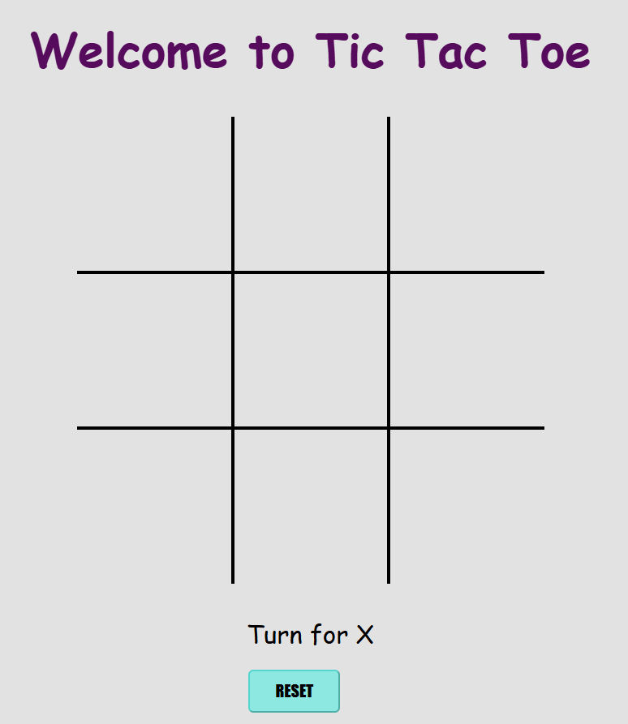

# Tic Tac Toe Game

View here --> [tic tac toe](https://arsha2207.github.io/Tic-Tac-Toe/)

A simple, interactive web-based Tic Tac Toe game built using HTML, CSS, and JavaScript. The game allows two players to take turns and play Tic Tac Toe on a 3x3 grid.

## Features

- **Two-player gameplay:** Players alternate between "X" and "O".
- **Win detection:** Highlights the winning combination (row, column, or diagonal).
- **Draw detection:** Notifies when the game results in a draw.
- **Responsive design:** The game adapts to different screen sizes (from desktop to mobile).
- **Game reset:** A "RESET" button to start a new game at any time.
- **Visual effects:** Animation on winning or drawing, along with sound effects.

## Game Preview

## How to Play

1. Players take turns clicking on an empty box to place their mark ("X" or "O").
2. The first player to align three marks vertically, horizontally, or diagonally wins.
3. If all boxes are filled without a winner, the game is declared a draw.
4. The game can be reset at any time by clicking the "RESET" button.

## Technologies Used

- **[HTML5](index.html):** Structure of the game layout.
- **[CSS3](style.css):** Styling and animations.
- **[JavaScript](script.js):** Game logic and functionality.
